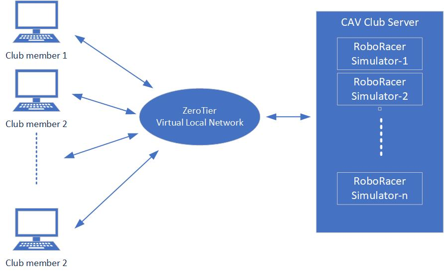
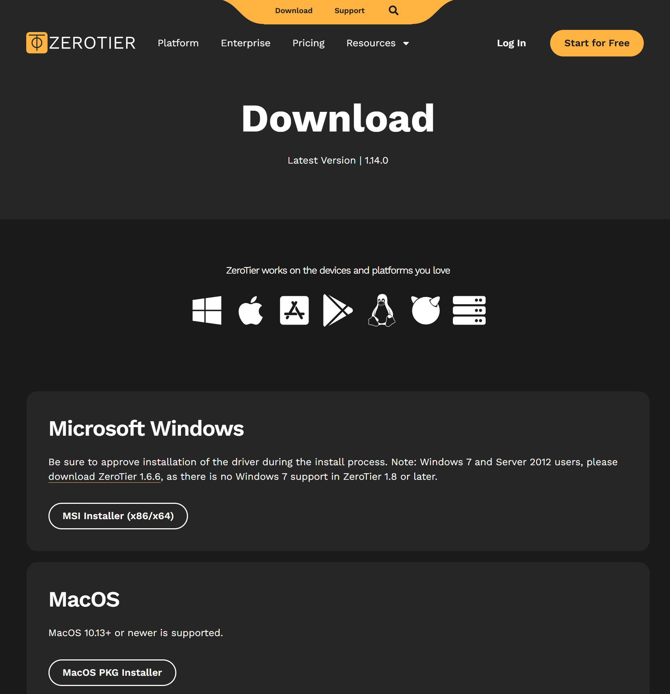
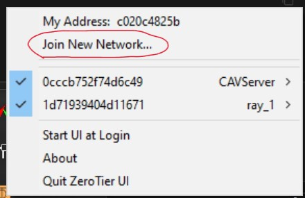

Our club use F1Tenth as a platform to bulid, learn, test and research on autonomous driving. The [F1Tenth official site](https://roboracer.ai//index.html) provides detailed tuturials on building, learning and racing with the F1Tenth race car platorm. It is encouraged to go through the website as a learner, at least it is a first-to-go place when you get related quesitons.  
**This document serves as a tutorial for UVic Connected Autonomous Vehicle (CAV) Club members to quickly get on-boarded and play with the autonomous driving algorithms in simulaiton and on a physical car.**  


# 1. Environment Configuration
We know how frustrating and time-consuming to set up an environment to run our algorithms in simulation or on a car. Don't worry, we already have a ready-to-race car and have built a simulation enrivonment for you to play with.  As a club member, you can get access to our club server through a VLAN and use the RoboRacer Simulator assigned to you. 



## 1.1 Install the ZeroTier client
Go the [ZeroTier download page](https://www.zerotier.com/download/) to download the installation package for your computer.  



After installation, launch ZeroTier. From the configuration menu, click ***Join New Network...***
Type in the network ID `0cccb752f74d6c49` of CAV Club Server. After authorizing your access request, you will be in our club's virtuall local network and have access to the club server.



## 1.2 Access to Club server
With VLAN connection to our club server, we will offer you the following information:
- **Your local IP address**
- **Club server IP address**
- **Your SSH port**
- **Your remote desk port**
- **Your SSH user name**
- **Your SSH password (you can change later)**

With the above information, you can use two ways to access the club server: **SSH and Remote Desk**

### 1.2.1 [SSH](#1)
1. SSH from your terminal
```bash
ssh -p [your ssh port] [your ssh user name]@[Club server IP address]
```

2. SSH with a client


### 1.2.2 Remote Dest

Download a [VNC viewer](https://www.realvnc.com/en/connect/download/combined/?lai_vid=l2lnAq2W1FnD&lai_sr=15-19&lai_sl=l&lai_p=1)

Then connect to the club server with `[Club server IP address]` and `[Your remote desk port]`

# 2. Play with simulation
Enter the Command Line Interface of your remote machine, as mention in [Section 1.2.1](#1)  
Execute the following commands.
```bash
# Enter the sim_ws work space, you don't have to run this command if you are already in.
cd ~/sim_ws

# Source the ROS 2 Foxy environment setup script
source /opt/ros/foxy/setup.bash

# Source the local workspace setup script
source install/local_setup.bash

# Launch the F1Tenth gym bridge to connect simulation with ROS 2
ros2 launch f1tenth_gym_ros gym_bridge_launch.py
```

To play with your own algorithm, for example, `gap following`.
Make sure you are under `sim_ws` before you execute the following commands
```bash
# Build the gap_follow package using colcon build system
colcon build --packages-select gap_follow

# Source the local workspace setup script to make the package available
source install/local_setup.bash

# Run the reactive_node.py script from the gap_follow package
ros2 run gap_follow reactive_node.py
```


# 3. Play with the physical car
